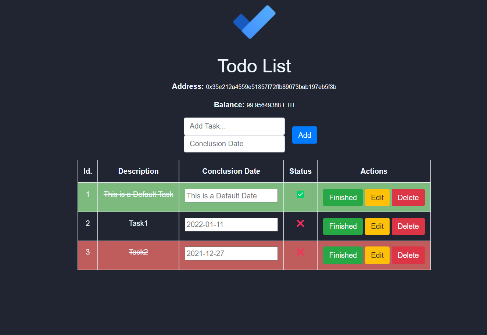

# Ethereum Todo List with Solidity 

___

##    About :clipboard:
A ToDo List using Solidity Smart Contracts, based on [Ethereum](https://ethereum.org)

___

## Used Technologies :computer:

    

___

##    Stuff You Need :arrow_down:

- [Ganache](https://next-stack.github.io/ganache/)
- [MetaMask](https://metamask.io/)

```bash
npm install -g truffle@5.0.2
npm install
```

##    Compile Ethereum Smart Contracts :page_with_curl:

```bash
truffle compile
truffle migrate --reset
```

##    Run Web Client :running:

```bash
npm run start
```

##    Test Smart Contract Deployment :vertical_traffic_light:

```bash
truffle test
```
___

##    Main Page :books:


##    Manage your Tasks :pushpin:



___

## **Contributors** :sparkles:

<html><i><b> Mestrado em Segurança Informática - Universidade de Coimbra<br>
Criptografia - 2020/2021 <br>
Coimbra, 31 de dezembro de 2021
</b></i></html>

:mortar_board: *[Rodrigo Fernando Henriques Sobral](https://github.com/RodrigoSobral2000)*

___

## License :link:
Have a look at the [license file](../LICENSE) for details
___
