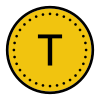
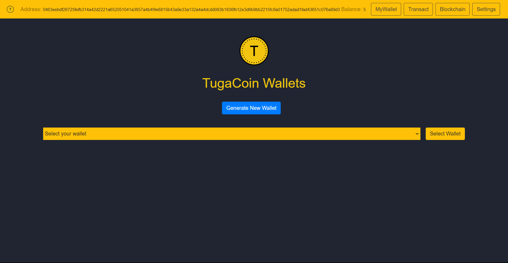
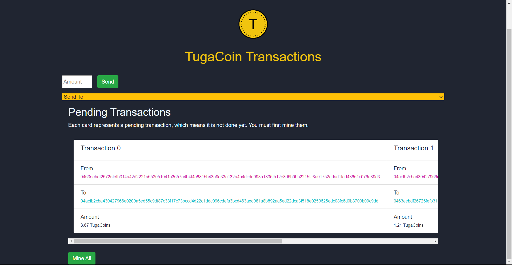
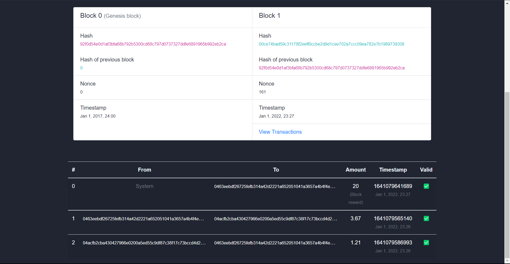
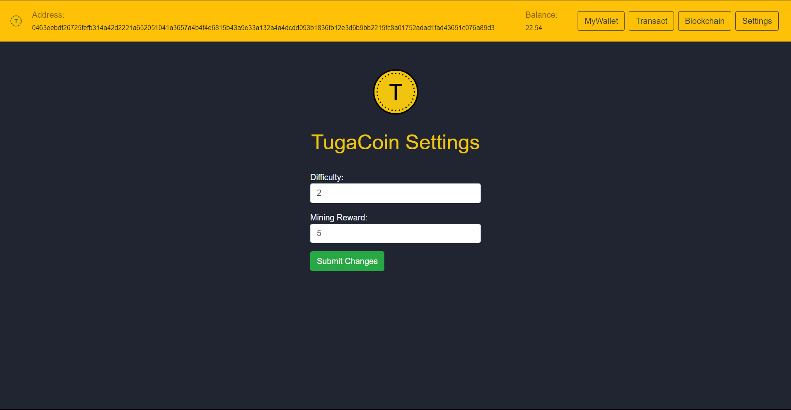
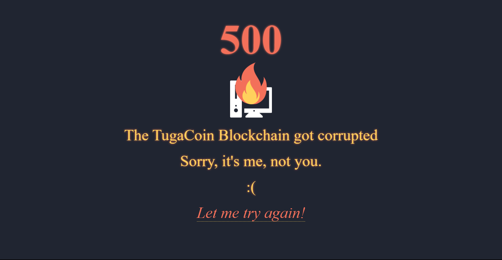

# TugaCoin  - Cryptography Assign

___

##    About :clipboard:
A Crypto Currency made by a Tuga, which is the name we give to the 2016 Euro Cup Winners.

> ⚠️
> This is a demo project, not a real cryptocurrency!

___

## Used Technologies :computer:

  

___

##    Stuff You Need :arrow_down:

```bash
npm install
```

___

##    Run Web Client :running:

```bash
npm run start
```

##    Main Page :credit_card:



##    Transact :money_with_wings:




##    Blocks on Chain :link:



##    Settings :wrench:



##    Corrupted Blockchain :rotating_light:



___

## **Contributors** :sparkles:

<html><i><b> Mestrado em Segurança Informática - Universidade de Coimbra<br>
Criptografia - 2020/2021 <br>
Coimbra, 31 de dezembro de 2021
</b></i></html>

:mortar_board: *[Rodrigo Fernando Henriques Sobral](https://github.com/RodrigoSobral2000)*

___

## License :link:
Have a look at the [license file](../LICENSE) for details
___
